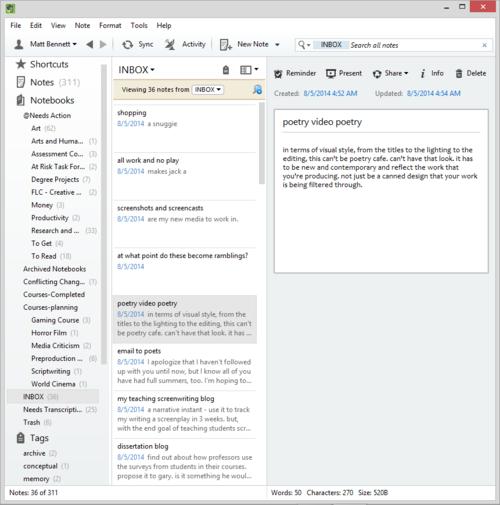

you never know when inspiration will come to you and you need to be able to quickly take some notes in order to, later, develop the idea, file it away, or work it into something you're currently producing. some people can manage this by juggling little, inconspicuous **idea notebooks.**

i admit, i try. i love the jimmy olsen feeling of palming a flip-cover moleskin with one hand, and licking the tip of your lead pencil, held intently by the other. i spend more time typing up notes i've handwritten in those little notebooks, though, than i do making use of the notes to create work. others, perhaps stubbornly holding on to comfortable, lo-tech creativity aids, endlessly shuffle ideas inscribed on 3 x 5 index cards into full houses and straights of creativity.

**my *idea file* is evernote.**

and not just my ideas for stories and screenplays. my ideas for everything: academic research projects, notes for the next week's lecture, my grocery list, my ideas for task force and committee meetings. evernote fills the gaping hole left by a memory that has receded as fast as, if not faster than, my hairline. my *idea file* is a giant brain dump. and when i say dump, i mean a dump. the only way i can really convey the full meaning of this is to share my dump with you. Here's a glimpse into the future. Yes, I'm still dumping. Yes, the cistern is still full.

<pre>
Sunday, January 3, 2021 9:39 PM

Bad panda

Services of
projective
testing 

<em>I'm thinking of ending things</em>
Kuleshov experiment

Quick Notes 3 Page 10

# Alpha Flight
</pre>

part of every work day is spent processing the ideas: organizing, making to-dos, copying flashes of dialogue out of notes and into scripts, dashing them off in emails to colleagues and collaborators. the *idea file* does no good unless you are in there fiddlin' around every day. some of those ideas will sit in there indefinitely, may never come to fruition. that's okay. but others. others may someday be your breakthrough script or your pulitzer-winning novel. the way i think about my *idea file* is as a well or a cistern. a cistern is used to 1) contain water and 2) make it readily accessible for use. evernote, for me, is the cistern into which i dump buckets i've collected from my ***stream of consciousness***.

buckets and buckets of ideas, word doodles, prewriting, concerns, notes, whatever. getting them out of my mind and putting them in evernote makes them accessible later, when i have time and am in the state of mind to process them. and processing sometimes just means deleting. evernote (damn i wish i had an endorsement from evernote. somebody give me some goddamned money) is available across platforms, making it accessible from pretty much anywhere. i use it on my mac desktop at work and my pc laptop at home or from the coffeeshop and my android tablet from the tent. i use it is as a voice note recorder on my android phone. long drives are often fruitful creative periods for me, so it's nice to be able to get down your ideas verbally while driving. if evernote isn't already in your workflow, it's worth trying. however, the tool is not so important as the habit. make capturing your ideas **when they happen** a habit. that's important if you're an absent-minded professor like me. but no matter what your age, memory is fleeting and not to be trusted. under any circumstances. what. so. ever. nope. keep reading brande. she knows how the writer do.
