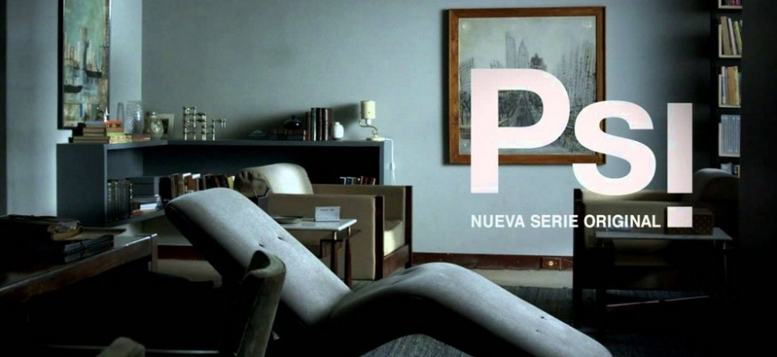

 Please consider attending the next event sponsored by the Association for Psychoanalytic Thought on **Friday, January 22nd, 2016:**

***A Story about Psicanálise (Psychoanalysis) in Latin America***

The Association for Psychoanalytic Thought (APT) is pleased to present a viewing of an episode of the HBO Latin America Channel series, *Psi* about a psychoanalyst living and practicing in São Paulo, Brazil, based on the writings of Brazilian psychoanalyst Contardo Calligaris. Calligaris trained in Switzerland and France and moved to Brazil. He is a columnist as well as a clinician and has written several psychoanalytically oriented novels. He is the creator of the series.

The viewing will be followed by a discussion by Natalia Jacovkis, professor of Modern Languages at Xavier University, and Karl Stuckenberg, professor and chairman of Psychology at Xavier University and a CPI faculty member.

The event will be held in the Kapp Memorial Library of the Cincinnati Psychoanalytic Institute, 3001 Highland Ave., Suite C, Cincinnati, Ohio 45219. The event begins at 6:30 pm with wine and cheese and the program begins at 7 pm. Admission is $5.00.
