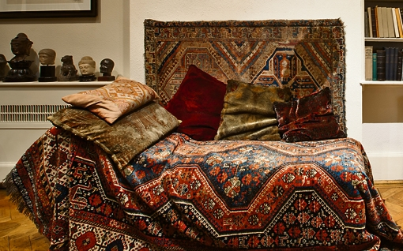

Sigmund Freud, the father of psycho­analysis, remains a great thinker still needed in a troubled world some 77 years after his death at the house in Maresfield Gardens, Hampstead, now the Freud Museum, which celebrates its 30th anniversary in July.

While many local residents are unaware that this is where Freud lived when he escaped from Nazi-occupied Austria in 1938, his reputation remains international and the house is one of London’s best historic centres of excellence in research and education at the cutting edge. Some 28,000 people visited the museum last year. There were those who have concerns about mental health, as well as some visibly moved at the sight of Freud’s famous couch while others take comfort sitting on a replica, specially provided...

[http://www.camdenreview.com/node/991484](http://www.camdenreview.com/node/991484)

Gerald Isaaman - *Camden Review*
