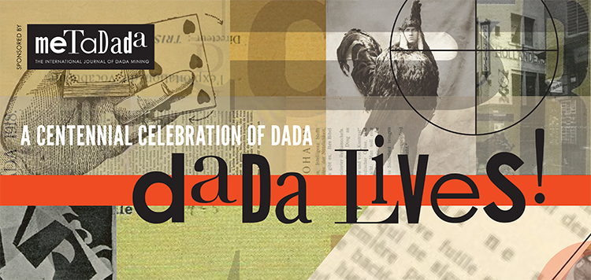

Dada Lives! is an international exhibition by contemporary Dada-inspired artists from across the United States, and over 20 other nations, conceived to celebrate the centennial of the founding of the Dada movement in 1916. The exhibition’s opening reception is also the publication party for a new, contemporary Dada art and poetry review, MetaDada: The International Journal of Dada Mining, the inaugural issue of which will be published on the 100th anniversary of the first Dada publication, Cabaret Voltaire, which appeared on May 15, 1916.

Please join us for the opening artist reception on Friday, April 29, 2016 from 5-9pm at the UCBA College Art Gallery.

[https://www.facebook.com/events/224983567876757/](https://www.facebook.com/events/224983567876757/)
