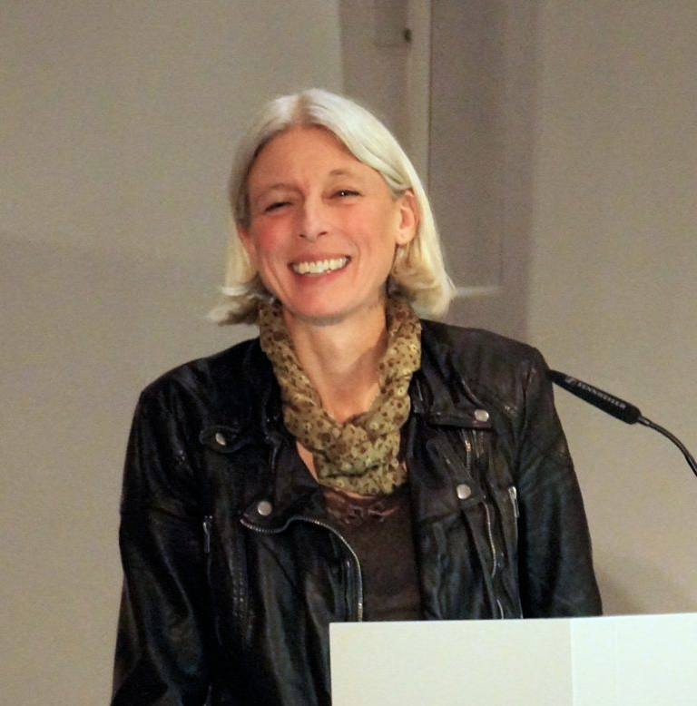

**Dagmar Herzog**, eminent historian and author of ***[Cold War Freud: Psychoanalysis in an Age of Catastrophes](https://www.amazon.com/Cold-War-Freud-Psychoanalysis-Catastrophes/dp/1107072395)***, will be speaking at the University of Cincinnati for three separate events later this month. She will be leading seminars on that book and her latest project, ***Unlearning Eugenics: Sexuality, Reproduction, and Disability in Post-Nazi Europe***, on Friday, February 23 for members of the UC community.

Her third speaking engagement is a public lecture: <strong>"On Aggression: Psychoanalysis as Moral Politics in Post-Nazi Germany,"</strong> in Room 350, Dyer Hall, on <strong>Thursday, February 22,</strong> from **4:00-5:30 p.m.** This lecture is drawn from a chapter of *Cold War Freud*.

If you plan to attend, please RSVP to Dr. Ethan Katz, Assistant Professor of History, via email at [katzen@ucmail.uc.edu](mailto:katzen@ucmail.uc.edu).

**Dagmar Herzog** is Distinguished Professor of History and Daniel Rose Faculty Scholar at the Graduate Center, City University of New York. She conducts transnational and comparative research on how religion and secularization have affected social and political developments in modern Europe. An expert on the histories of Nazism and the Holocaust and their aftermath, she gives particular attention in her research to methodological innovations in critical source analysis and in gender and sexuality studies.

Herzog is one of the leading scholars today of European History, Cultural History, History of Religion, History of Post-Holocaust memory, and History of Gender and Sexuality.  She was awarded a 2012 John Simon Guggenheim Memorial Foundation Fellowship for her trans-Atlantic research project on the European and American histories of psychoanalysis, trauma, and desire. Her just-published *Cold War Freud: Psychoanalysis in an Age of Catastrophes* (2017) grows from that research.
