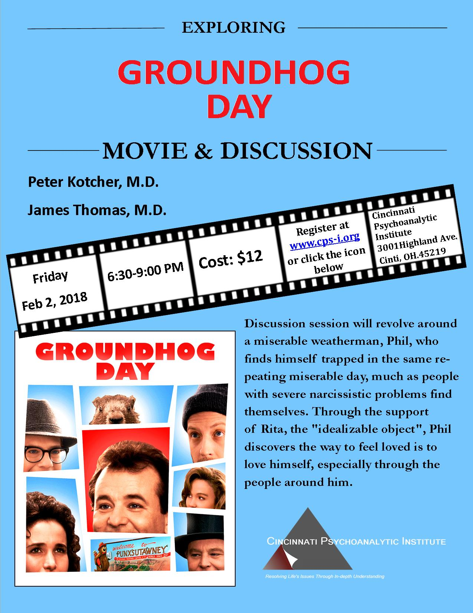

The Cincinnati Psychoanalytic Institute will hold its annual discussion and screening of the film, *Groundhog Day* (dir. Harold Ramis, 1993), on Groundhog Day, Friday, February 2, 2018 from 6:30-9:00 p.m. This year marks the 25th anniversary of the release of the film.

Discussion of the film from a psychoanalytic perspective will be facilitated by Peter Kotcher, M.D. and James Thomas, M.D. The screening will take place in the [Frederic Kapp Memorial Library at CPI, 3001 Highland Avenue, Cincinnati, OH 45219.](https://goo.gl/maps/puzcPJTeQ4u) The cost is $12.

[Click here to register for this event.](https://cpi.memberclicks.net/index.php?option=com_mcform&view=ngforms&id=36349)

