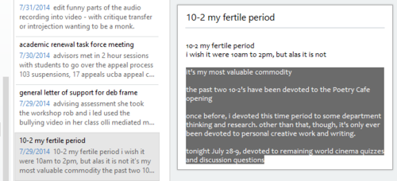

let's back up a few steps. i've mentioned a couple of times that one of the purposes of my media scriptwriting is to build a *habit* of writing. let's first talk about *WHEN* to find your fix.

the answer is: *regularly*. getting anything written takes time, and so the sooner you establish a weekly writing schedule, the quicker you will meet your writing deadlines. if writing schedules haven't worked for you in the past, maybe you haven't done much more than make it fit into your calendar. you have to make it fit in your life.

being productive during a scheduled writing session will make you feel good about the session and about scheduling it. do it at least once.

i find that my writing productivity is better at certain times of day than others. try to find your ***fertile period***,

(or, as i refer to it, my **"fertile crescent,"** the result of some random geography-related synapse firing at the time of writing).

my fertile crescent is, unfortunately, from **10pm to 2am**. i have, my entire life, wished it were flipped 12 hours. i will never lead a normal life, but if my fertile crescent waned instead of waxed like most others, my life would sure as heck be easier.

i've always been a night person. i stayed up late as a kid, occasionally worked third-shift jobs and evening shifts in bars. and so, still, i'm drawn to my natural sleep schedule, which continues to pull at me like the tides. it gets me in trouble. both at work and socially. i sleep through friends' birthday parties. through appointments with my shrink.

i'm forever apologizing for something that i can never fully explain. something that, even if i could, would only ever really be understood by someone who shares the same curse. the repercussions of my particular fertile crescent are that i will forever be perceived as just lazy, or late. or lethargic.

sometimes those perceptions are accurate. i'm only human. sometimes i burn out. sometimes my morale is low. sometimes i just need a mental health break. in a tent. under some trees. in a campground in long island.

my fertile crescent is a curse, and a gift. it is my period. inconvenient as it is, it's also my most valuable commodity. time. is. money.

**don't try to force yourself into an unnatural writing schedule. it will work against you.**

instead, let your writing habit dictate when it needs to be fed. this may mean making adjustments to or, heaven forbid, sacrifices to that other unnatural schedule, that glorious habit, sleep. do what you have to in order to free some time during your fertile crescent for writing. or, if you're single-minded enough, if your ritalin, or nicotine, or whatever keeps you focused is working, devote whole fertile crescents to a single project.

**institute naps on the days after writing sessions.**

**take siestas. set multiple alarms. at multiple times. placed in multiple locations around the room.**

if you force yourself into a writing schedule that is out of sync with the ebbs and tides of your body's natural creative flow, its circadian rhythms, you will start to hate writing. it will become steadily laborious instead of habitual. do what you have to do in order to write. find ways to make the most of your limited time. one concrete technique for making the most of your time that i would like to suggest is to keep an ***idea file***.

you never know when inspiration will come to you and you need to be able to quickly take some notes in order to, later, develop the idea, file it away, or work it into something you're currently producing. i'll talk more about how i use my idea file next time.

the classic text on feeding the writing habit, *Becoming a Writer*, first published by Dorothea Brande in 1934.

this book is not so much about the *mechanics* of writing as it is about building a *life* of writing.
