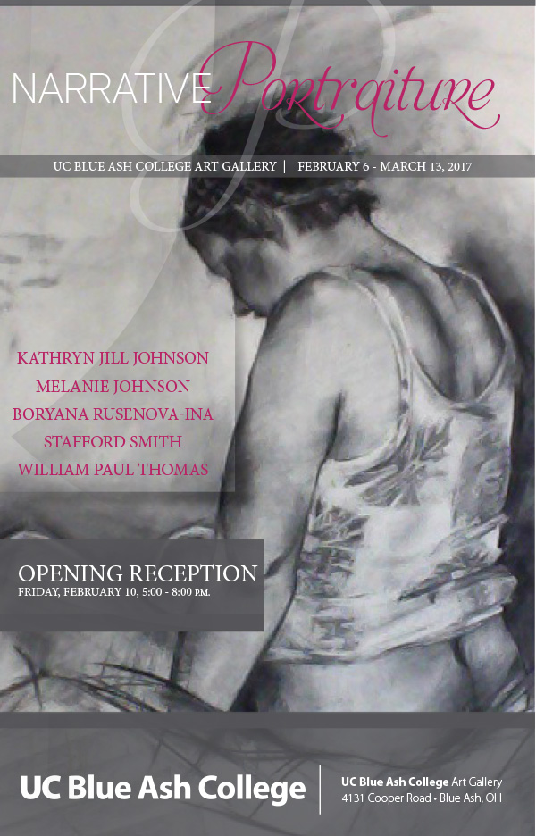

The [UCBA Art Gallery](https://www.facebook.com/ucbagallery/) will be hosting a reception this **Friday, February 10, 2017 from 5:00 – 8:00 PM.** The reception is free and open to the public, with refreshments provided. We are celebrating the opening of the current exhibition, *Narrative Portraiture*. This show will be on display from February 6 – March 13, 2017 and features the work of five artists: Kathryn Jill Johnson (Huntsville, AL), Melanie Johnson (Prairie Village, KS), Boryana Rusenova-Ina (Columbus, Ohio), Stafford Smith (Grand Rapids, MI) and William Paul Thomas (Chapel Hill, NC). The work in the exhibition has been selected because these artists all use various techniques to present portraits of human subjects that tell stories. The work consists of painting, drawing, fabric, photography and video.

Facebook event information: [https://www.facebook.com/events/1793360797656021/](https://www.facebook.com/events/1793360797656021/)
