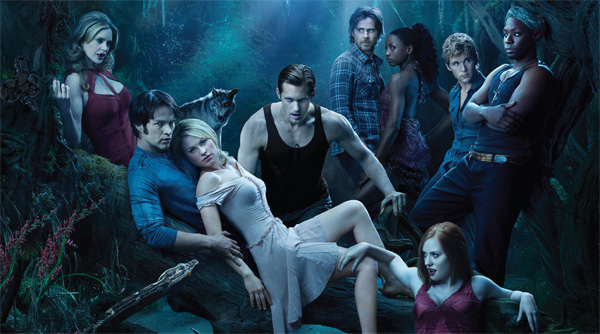

### Sookie and Symptom, Vampire and Void: Irruption of the Real in True Blood

February 18, 2016 · [Volume 20 (2016)](http://journal.psyart.org/article_category/volume20/)

#### Abstract

Sookie Stackhouse, the protagonist of HBO’s True Blood, is a telepath who has grown up knowing what people “really” think. From the first episode, however, moments suggest we view her character symptomatically—after all, she hears voices in her head. The series then becomes an illustration of Lacanian concepts of subjectivity and the Real. Sookie is a sexually-repressed 24-year-old virgin, molested by her great uncle and left in the care of her grandmother, with whom she still lives after losing both parents. The extimate sexualized voices in her head can be read as a mechanism constructed to cope with traumatic loss and abuse, and to justify her repression. The introduction of vampire Bill Compton signals the irruption of the Real in the Symbolic order. His unreadable mind presents a void upon which to project her fantasies, but their relationship, mirroring that of analyst and analysand, provides a way for Sookie to work through her symptoms.

View the full article here:

[http://journal.psyart.org/article/sookie-and-symptom-vampire-and-void-irruption-of-the-real-in-true-blood/](http://journal.psyart.org/article/sookie-and-symptom-vampire-and-void-irruption-of-the-real-in-true-blood/)
