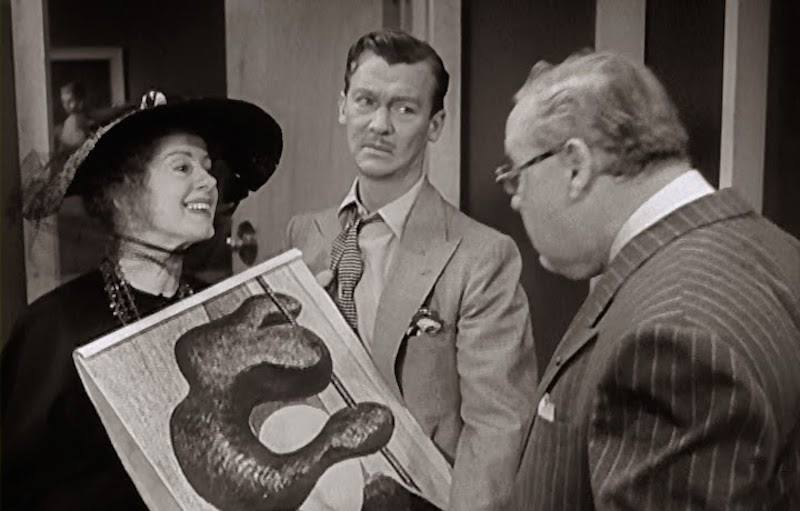

## [L'Art Noir: The Perfidy of Images in Film Noir](http://ijhl.cgpublisher.com/product/pub.246/prod.126)

#### by Matt Bennett

*The International Journal of Literary Humanities*, [Volume 15](http://ijhl.cgpublisher.com/product/pub.246/prod.123), [Issue 1](http://ijhl.cgpublisher.com/product/pub.246/prod.124), March 2017, pp.9-14.

**Abstract:** Amidst the hardboiled detectives, doomed protagonists, and femmes fatales in “films noirs,” works of art often operate as characters in their own right, effecting their own double-crossings. Thus far, the presence of art in the mise-en-scene has remained a largely untapped resource in helping to understand these popular American films of the 1940s and 1950s. In this article, I explore the deployment of art in noir as a duplicitous narrative device, with intentions ranging from confusion through deceit to destruction. Art can function to drive the narrative, but can also serve as a canvas upon which characters can project their own fantasies. Art can also be understood as the product of the sublimated sex drive of artist characters appearing in the films. The capacity of images to conceal the truth is fully taken advantage of in noir, and the perfidy of those images is central to the narrative of many of the films.
