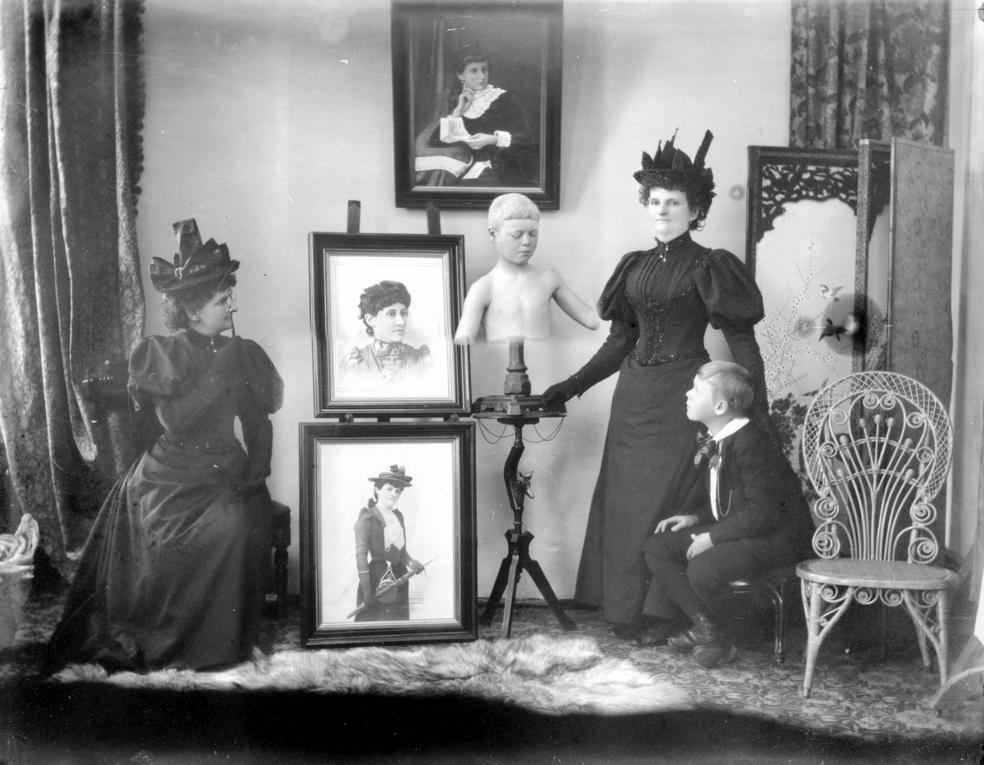

## [Totem and Tableaux: The Elegiac Photography of Hannah Maynard](https://cgscholar.com/bookstore/works/totem-and-tableaux)

#### by Matt Bennett

*The International Journal of Literary Humanities*, [Volume 14](http://ijhl.cgpublisher.com/product/pub.246/prod.98), [Issue 4](http://ijhl.cgpublisher.com/product/pub.246/prod.117), December 2016, pp.55-63.

**Abstract:** Although there is no evidence that Canadian photographer Hannah Maynard (1834–1918) produced post-mortem photographic images in her fifty-year-long career as a portraitist, she did create a kind of recurring elegy to the dead in many of her experimental images. Apparition-like photo-statuary of living subjects posed in typical Victorian allegories of death appear frequently in her work. She also created complex multiple exposures, some of which include purposefully placed portraits of dead family members, photographed in life. Maynard’s images, employing techniques of collage and “re-photography,” work to level distinctions between the living and dead.
