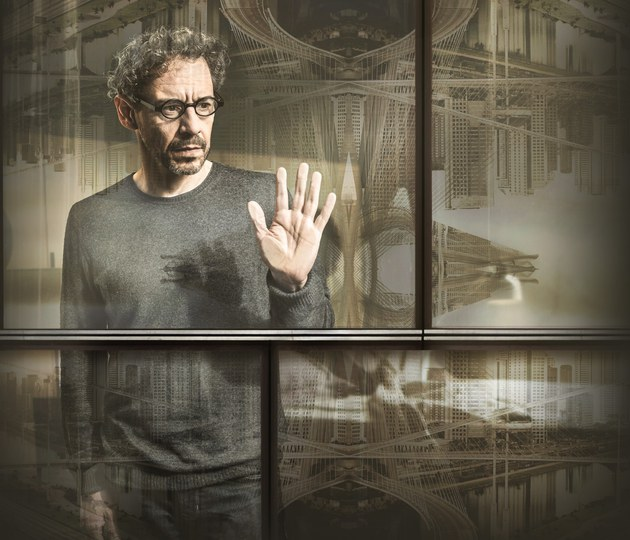
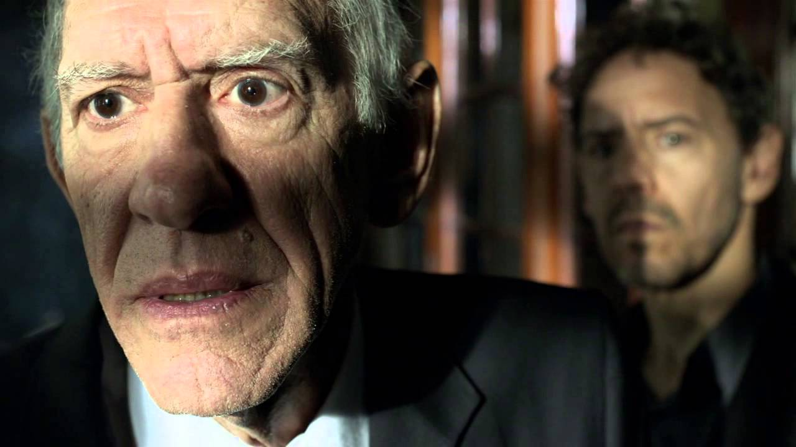

On Friday, January 22nd, the Association for Psychoanalytic Thought screened an episode of the Brazilian television series, *Psi*, about a psychoanalyst, Carlo Antonini, his family, and his practice in São Paulo. The series is co-written by Contardo Calligaris, a well-known Italian psychoanalyst, novelist, and playwright who lives and works in Brazil. The episode screened involved a patient, Milton, who believes his dead wife is communicating with him from beyond the grave. Leading discussion of the episode were Dr. Natalia Jacovkis, Associate Professor of Spanish at Xavier University and specialist in film and media studies, and Dr. Karl Stuckenberg, Chair of Xavier's School of Psychology.

Dr. Jacovkis introduced the screening by explaining the production environment for television in Brazil, where big-budgets and leading actors contribute to quality television programming, outshining even film production. This was well-evidenced with *Psi*, which is a finely-crafted, thought-provoking, and superbly-written piece of entertainment. Much of the narrative impact of the episode is created by several subplots that are tightly-integrated with the main storyline, one following Antonini's sessions with another patient whose brother and nephew died in a car crash and a second focused on the death of his daughter's dog. The multiple storylines involving death and mourning work together to create a thematic unity missing in much mainstream American television.

The loneliness and isolation characters experience in the metropolis of São Paulo is another striking aspect of the series, pointed out by Dr. Jacovkis. The severe, austerely-depicted city provides Dr. Antonini with a steady clientele of troubled psychoanalytic patients, but he, too, is troubled. He maintains a predominantly sterile and clinical demeanor in his interpersonal relationships, not only with clients, but also with his ex-wife and children. However, he is warm and genial with his colleagues, showing a likable side to the good doctor. In general, all the characters are complex and multidimensional, important to a series concerned with the human psyche.

It is toward that human psyche that Dr. Stuckenberg steered the discussion after the screening, when he invoked Freud's essay on "Mourning and Melancholia" as a lens through which to understand Milton's delusions. Overwhelming guilt and anger are attendant with his grief, but when Milton confesses to having killed his wife's dogs, Dr. Antonini identifies his confession as too detailed, too rehearsed. This causes Milton to erupt in an uncalculated tirade involving everything that he hated about his wife, from her telling pointless stories to smelling bad "down there." By the end of the episode, the purgation of Milton's feelings of anger and hatred toward his dead wife provides him with some relief, but there is still much work to be done. Ultimately, as noted by Dr. Stuckenberg in closing the discussion, it matters not whether the ghosts of our loved ones are real or imagined; we must still process our own conscious and repressed feelings toward those loved ones in order to exorcise their spirits.
