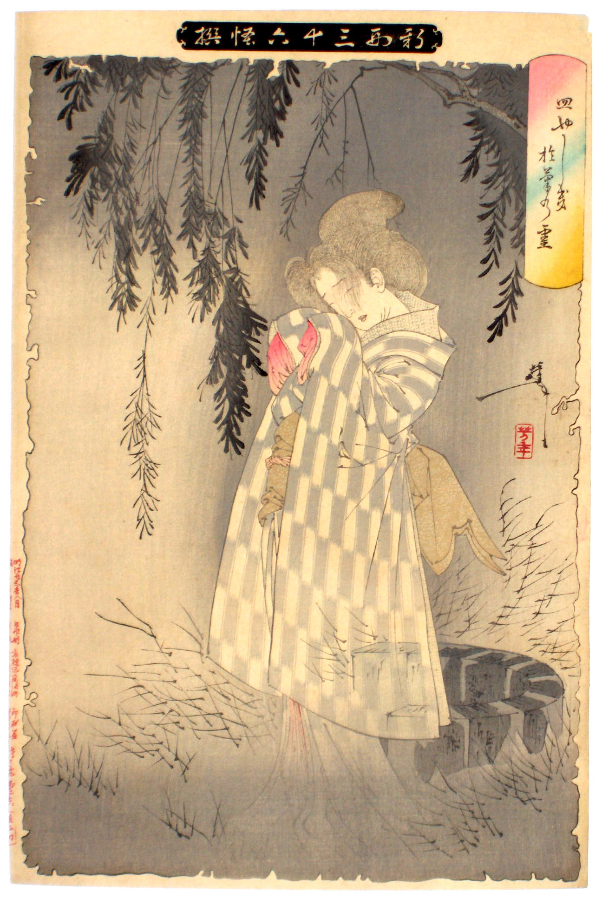

  
Yoshitoshi's *Banchō Sarayashiki*

At last night's December meeting of the Association for Psychoanalytic Thought, I had the pleasure of speaking as part of a round-table discussion titled, "Psychoanalysis and Culture: Psychoanalytic Concepts in the College Classroom." The other two presenters were Norman Finkelstein, Professor of English at Xavier University, and Rachel Zlatkin, Honors Professor at Northern Kentucky University. Dr. Zlatkin began the discussion with readings of quite different versions of the Little Red Riding Hood fairy tale as cautionary tales about young women's sexuality. I then spoke about the "return of the repressed" in horror films and sublimation in film noir. Dr. Finkelstein ended the discussion with readings of Joseph Conrad's *The Secret Agent* and Patricia Highsmith's *The Talented Mr. Ripley*.

As Norman Hirsch, president of the APT noted, while the influence of psychoanalysis has waned in departments of psychology and psychiatry in American universities, it has seen a resurgence in the humanities. The three of us provided examples of how we use psychoanalytic theory in our research and in our college-level pedagogy. A psychoanalytic approach is but one hermeneutic we use in the classroom to help students make meaning of texts, but a still-important one, nonetheless. An interimplication of psychoanalytic theory and the products of popular culture is fruitful to the understanding of both, and I hope that the examples we three shared gave evidence to that effect.

Discussion afterwards was heated, as usual. An audience member noted that each of us only referred to Western texts, implying that psychoanalysis may not be a universal lens through which to examine texts from other cultures. A critical cultural theorist in the audience responded that the work of Claude Lévi-Strauss shows the presence of universal structural elements in the mythologies of various cultures that can be accessible to psychoanalytic theory, regardless of cultural context. The speakers were in agreement with her.

I must admit, however, that I have been reticent to apply psychoanalysis to the texts of non-Western cultures in my own work.  Just how much of the Oedipus, for example, can be attributed to the universal nature of the human unconscious, and how much to family structures and child-rearing practices particular to the West? I believe that a work of art cues us as to how we might read it, which hermeneutics might be appropriate in its interpretation, and I have sought to look for theories originating in the cultures in which the art was produced. My interests in Japanese art and film and in psychoanalytic theory have led me to the wish to find some psychoanalytic entrée into the interpretation of Japanese art. And yet, in the back of my mind echoes Lacan's infamous statement that the Japanese are unanalyzable. But what of their art?

In seeking some means of applying psychoanalytic theory to Japanese art, I've researched broadly the place of psychoanalysis and Japan; read of the concept of *amae*, the *Ajase complex*, and the "don't look" prohibition; and tried my best to find ways of utilizing distinctly Japanese psychoanalytic theory. Still, this is beyond my comfort level and I've not been successful in these endeavors. The Japanese psyche seems to me to be guided as much by Shinto, Buddhism, and distinct social practices as by Freudian, Kleinian, or Lacanian theories of the unconscious, desire, and subjectivity. Does this mean that employing psychoanalytic theory to analyze Japanese art would be misguided, a misapplication of that theory?

I've not settled on an answer, but I certainly think it's worth investigating further.
