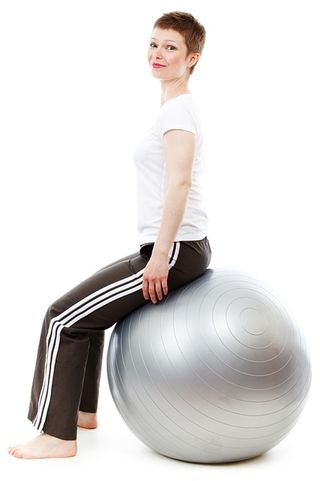

> Core training has become the gold standard for physical fitness.

[https://www.psychologytoday.com/blog/headshrinkers-guide-the-galaxy/201603/psychoanalysis-core-training](https://www.psychologytoday.com/blog/headshrinkers-guide-the-galaxy/201603/psychoanalysis-core-training)

Jennifer Kunst - *Psychology Today*
