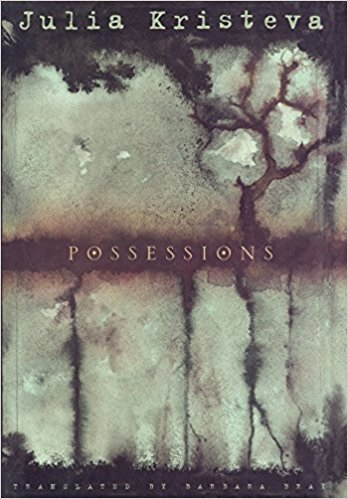
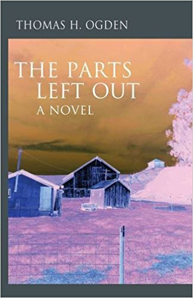

The Association for Psychoanalytic Thought is pleased to present **“Psychoanalysts as Novelists”** on Friday, January 19th, 2018 at the Cincinnati Psychoanalytic Institute, [3001 Highland Ave., Cincinnati, Ohio 45219](https://maps.google.com/?q=3001+Highland+Ave.,+Cincinnati,+Ohio+45219&entry=gmail&source=g).

Beth Ash, Professor of English at the University of Cincinnati, will discuss Julia Kristeva’s novel, ***Possessions.*** 

> "All similarities between *Possessions* and your average hard-boiled detective novel end with the headless corpse that shows up at the beginning of Julia Kristeva's novel. Kristeva, you see, is not your average writer of detective fiction. She is a psychoanalyst and linguistic theorist, the author of books on both language and depression--two themes she weaves through this intellectual mystery. The tale begins with Gloria Harrison, a translator who is murdered and decapitated after a dinner party. Enter Stephanie Delacour, an old friend of the victim and a journalist with a nose for murder. Though Kristeva has provided all the necessary components for a standard mystery--a victim, several suspects, and a detective--she seems far more interested in exploring the psychological issues surrounding her characters than the crime itself. The pages of *Possessions* are filled with reflections on motherhood, depression, semiotics, and more. So if you're looking for a mystery novel that will stimulate your brain rather than your adrenaline production, *Possessions* is a good place to start." *\--Amazon.com review*

Norman Hirsch, psychiatrist in private practice, and Rachel Zlatkin, Professor of English at Northern Kentucky University, will discuss Thomas Ogden’s novel<strong>, *The Parts Left Out.*</strong>

> "Not only is \[Thomas Ogden\] the most creative psychoanalytic author writing today, but in this novel he shows himself to be a wonderful teller of tales. *The Parts Left Out* is an auspicious achievement. As a work of fiction it succeeds in accomplishing the most difficult of feats: to be both a spellbinder and an in-depth exploration of human traits that bring on unspeakable tragedy. Tom Ogden knows the human mind as few do. In The Parts Left Out he demonstrates his remarkable understanding not only of the mind, but of the human heart as well." --Theodore Jacobs, *Journal of the American Psychoanalytic Association*

The evening begins with wine and cheese at 6:30 PM followed by the program at 7 PM.  The presentation will be followed by audience discussion. Admission is $5.00.
