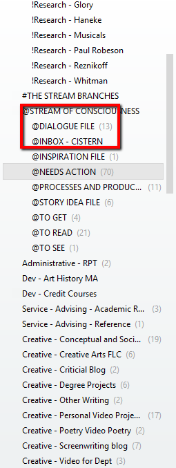

a student from my media scriptwriting course last term is struggling with a story in the horror genre. i'm hoping that by shifting gears and showing the development of my own horror story, *purgatory, pa*, i can also address specific needs of her script in its current state. i'm also hoping that anyone following along will benefit, since i tend to cover a pretty broad ground through multiple digressions.

here's some info from another course of mine that will let you know where i'm coming from when i talk about horror. the distinction between whether a film is a horror film or a sci-fi film may not seem relevant to you right now, with your particular story, but just consider the options. you are concerned about your story being too much like a film that is currently in production.

———

**horror**

a reductive, insufficient term of convenience for a number of subtly different responses:

- shock, suspense, terror, the uncanny, revulsion…

> "I recognize terror as the finest emotion and so I will try to terrorize the reader. But if I find that I cannot terrify, I will try to horrify, and if I find that I cannot horrify, I'll go for the gross-out. I'm not proud."
>
> — Stephen King, *Danse Macabre*, 1981

**what is a "horror film?"**

any study of film genre begins with differentiation, causing an empirical dilemma:

- as soon as we attempt to define a recognizable film form, we begin to qualify what we are trying to define. we pare away films that do not fit precisely and impose arbitrary boundaries on knowledge.
- my problem with this… the genre itself is largely about transgressing boundaries.

**we're locked in a circle, right from the beginning:**

- how can we typify a genre without first determining what texts constitute a genre…
- … even though this requires some prior decisions about the genre's identity or definition?

**two basic approaches:**

- **essentialist:** you start by defining the formal characteristics, then compare individual texts against that form to see if they fit. exclusive; produces a narrow body of work.
- **relational:** you start with a body of films (a canon) and look for shared characteristics. inclusive; pulls in films that blur the issue.

**the dilemma in action…**

is *Frankenstein* science fiction? or, is it horror? is science fiction a sub-genre of horror?

- [the Edison Company's version, 1910](https://www.youtube.com/watch?v=67ENQibFW9w)
- James Whale's version, 1931

**Frankenstein**

- classic overreacher plot
- man tries too hard to be God and suffers the consequences of his knowledge
- traceable in the West to Greek mythology: Prometheus and Icarus, for example
- largely conservative in nature: science leads to destruction

the novel by Mary Shelley upon which the Frankenstein films are based is a hybrid – it speculates about the scientific possibilities of the creation of human life, but that transgressive desire results in the creation of a terrifying monster.

horror and science fiction are intimately linked and frequently overlap, complicating any clear distinctions between the two. for example, we have horror films set in the future or monsters from outer space.

there are as many similarities as differences in the two, but each genre does have a core of distinct traits, a characteristic tone and mode of address, that differentiates it from the other.

**horror vs. sci-fi**

Bruce Kawin, "Children of the Light," in *Shadows of the Magic Lamp: Fantasy and Science Fiction in Film*, edited by George Slusser and Eric S. Rabkin (Carbondale: Southern Illinois University Press, 1985), 14–29:

- horror films address the unconscious, seek to close the door on unbridled curiosity
- sci-fi films deal with the conscious, the part of the brain that enjoys speculating on the predictable future. open to intellectual growth.

does this differentiation work for you?

**will we ever really be able to define the "horror film?"**

- human knowledge and experience are always changing; new things frighten us daily…
- …therefore, by necessity, our definition, already amorphous, of horror must constantly change. it is protean.
- this is key to the genre's vitality. integral to the workings of any film genre is one particular tension: **convention vs. innovation**

———

start back with the seed of your idea, your logline, your pitch, your concept. back before you wrote your first act. take that seed of your idea and put it through the questioning and thinking about horror and science fiction that happens in the lecture notes above. what new options does it open up that will take your story in a direction that you're sure that other film doesn't take? and don't fret about what you've already written if there are places you decide to change direction. nothing is wasted. nothing.

and that goes for everyone. if you find that you're going to have to erase whole pages of conversations you've written, conversations you love, because you've made a change in the direction of the story earlier in the script, don't worry. you're experiencing something called *revision*. it's a dreadful condition, but one that will change your script for the better, once you and your story pull through. stop worrying so much about keeping that dialogue you love so much and start worrying about the unity of action. the unity of place. the unity of time.

don't delete. cut that beautiful turn of phrase you labored so hard on out of this script, and paste it back into your idea file. in my idea cistern, i have a folder just for snippets of dialogue: new ideas or things i've overheard, but also things i've written for previous work, but didn't use. and speaking of not using, i just shared with you last week a pretty thoroughly worked up story that i will be putting away for a bit. and that's a good thing.

i said it was "pretty thoroughly worked up," but it was not without its problems, the largest of which is that the very seed of the idea is clichéd. It's such a cliché to attribute actions to an alternate personality that the issue may be insurmountable. why then, knowing that i am working at such a disadvantage from the start, would i develop that flawed seed to the point i did? that's because i have another student who ran into some issues with a story of his centering on a character with an alternate personality.

this is the greatest advice i can give to anyone who wants to write a *fight club*, or *sybil*, or *dr. jekyll and mr. hyde*: they've been written. and written and written. you are working against extraordinary odds if you're trying to compete with them. don't compete. do something extra-ordinary, not following the established patterns or adhering to the old clichés. and so, until i feel like i've worked *participant observer* into an extraordinary story, it will stay in the idea cistern. i'll pick back up at some later date on it, when i've let the story roll around in my head for a while.

**other kinds of conventions**

- narrative
- thematic
- character
- technique
- special effects
- clichés?

**conventions vs. intertextuality**

intertextuality - "the shaping of a text's meaning by another specific text"

- coined by Julia Kristeva, 1966
- explains a phenomenon, but not the motivation for use of the phenomenon:
  - allusion, reference - neutral
  - homage - reverent
  - pastiche - jocular, but respectful
  - satire - may be funny, but to a serious end
  - parody - campy, irreverent

if any of you have ideas for smashing the cliché of the alternate personality, let me know. i'd love to hear how you work and what you're working on.

———

in the meantime, for anyone reading along, these are my initial notes for the horror story, *purgatory, pa*. i'm going to try working them up into an outline / treatment and documenting why i make choices that i make. what i hope is that this models for you how you can try working through your own story problems. keep in mind that we're probably dealing with two very different subgenres of horror, so not every choice i make will work for your story, nor yours mine. but, even though i'm working on a psychological thriller, it's still a kind of monster movie. the monster in my story just wears a human mask. what or who is the monster in your movie?

don't feel like you have to post info about your current story here, but please feel free to do so. my hope is that former students and others are reading along and can offer advice to you and others, like myself, who are writing screenplays. also, i took over management of the cincinnati screenwriters meet-up group over the summer but haven't had a chance to really get organized. anyway, i'm hoping that some of those 177 folks will also be interested in participating in this online workshop. and, i'm hoping that some of my former students will consider joining the meet-up, to workshop your writing in person, too.

—————————————-

*(what follows are raw draft pages, fragments and all.)*

SOFT BG MUSIC (I was listening to Cassius mix of "We Can't Fly" by Aeroplane, which is ideal) OVER BLACK

FADE IN

EXT. PA TURNPIKE - NIGHT

CREDITS OVER a light green VW BUS, windows down in bright moonlight, racing along the straight monotony of the turnpike.

INT./EXT. VW BUS - NIGHT

BG MUSIC LOUDER INSIDE. QUICK CUT inside to SHAW, 35, softly gasps and jerks head up as if waking up. He catches hold of a lighted pad teetering on the steering wheel.

"What the"

Swerves. BG MUSIC cuts out for a sec, but then back while he regains control.

Shaw slows the bus, switching on his turn signal and moving into the right lane as he passes a simple, black BUGGY being drawn by a single black HORSE in the left. Shaw rubbernecks out the driver side window as he passes.

EXT. BUGGY - NIGHT

MUSIC SOFTER. SLOW MOTION passing the buggy. KINETIC TITLE, in simple white text that picks up the moonlight and the shadows cast by a couple of OS trees, "PURGATORY," moves at an intermediate speed between the camera and Buggy.

INT. VW BUS - NIGHT

MUSIC LOUDER. SLOW MOTION. OTS Shaw in the driver's seat, the view through the window reaches the seat of the buggy where an AMISH COUPLE stare back at him. A SICKLY CHILD, male, around 5 years old, is sprawled in the seat between them, his head in his mother's lap.

INT./EXT. BUGGY - NIGHT

MUSIC SOFTER. CUT IN XCU SLOW MOTION LATERAL MOVE PAST Sickly Child's penetrating stare.

POV Sickly Child

Shaw mouths in SLOW MOTION as the camera MOVES PAST.

"…a fucking"

INT. VW BUS - NIGHT

MUSIC LOUDER. RAMP BACK TO NORMAL SPEED as camera MOVES PAST the black Horse pulling the carriage. KINETIC TITLE, same text style and speed, "PA"

VO "…horse-drawn wagon"

CUT TO:

bobbing his head to the music and face-timing with his girlfriend.

onscreen, she's framed with a bunched, hanging shower curtain behind her. a soapy washcloth glove on the hand not holding her own ipad.

"a what?"

"an amish couple driving a horse and buggy. on the interstate. they almost ran me off the road. sonsabitches. where the hell am i?"

"that's a good question. where the hell are you? you're supposed to be here. i've got to get Jo to bed after her bath. she's going to be asleep when you get home."

BG MUSIC cutting in and out more.

"wait, let me turn this down."

he twists the satellite radio volume knob in the dash and the BG MUSIC FADES UNDER

"now, what were you saying?"

i said i'm almost finished with Jo's bath. when i get her to sleep, i will call you back.

okay. but let me talk to her first.

i told you. she's in the tub.

a speeding cop car with flashing lights and sirens screams by in the westbound lane just as Shaw goes through a tunnel. loses facetime connection. BG MUSIC becomes STATIC. He cuts the radio.

passing police and fire and ems repeatedly with increasing frequency

she tells him to be careful, he looks tired

no worries, it has to be just a few hours left til i get there

how many miles?

gps shows map and time at 11:59 pm, but a flashing red error message "GPS satellite lost"

i don't know. lost the gps. must have been that tunnel.

he wants to see the girl, Jo. Wilma sets up the

keys rattling in the door, gaunt, enraged man enters, PHILLIP TODD (38) shutting door loudly behind him.

"Phillip, what the hell are you still doing with a key to my apartment?"

"sammy."

"go in your room and put some toys in your kittykitty bag, pumpkin."

"no, don't go honey. gimme your hand dear."

the girl's confused.

(more firmly)

"yes, dear, you're coming to daddy's apartment tonight. go in your room and pack some toys…"

"toys?"

"no dear. come to mommy."

the child's eyes have not left her daddy and his promise of play.

(insistent)

"Jo. i said"

(cutting her off, more loudly)

"yes, pumpkin blossom. as many of your favorite toys as you can fit into your furry kitty bag."

From Shaw's

"Sam, he's got a knife!"

Jo runs offscreen to her bedroom.

"no, Jo!"

Phillip slits Sammy's throat.

"SAM! Oh God.."

Sammy's gurgling gasps go on OS, as Phillip stabs repeatedly.

(through tears)

"Sammy! Oh no, Sammy. Stop it! STOP IT, PHILLIP! STOP IT!"

Phillip drops the knife.

"What are you going to do, Shaw? you're *two hours away, near lancaster, pa.*"

Phillip walks os in the same direction as Jo earlier.

"c'mon pumpkin."

an inconsolable bluetooth call to the police;

"lancaster 9-1-1, what's the exact nature and location of your emergency?"

(slightly sobbing)

"lancaster? i need police in…"

"do you have a street address of the incident?"

"3001 W. 82nd St., Upper West Side Manhattan"

"Sir, you just said it was in Lancaster."

"No, I'm in Lancaster. I just drove past Lancaster, on the turnpike. The assault happened at 3001 W. 82nd St., Upper West Side Manhattan"

"Oh FUCK! Hurry, HURRY!"

he hangs up as the dispatch begins asking about his location:

"sir, where are you?"

(sobbing)

"are you driving? sir… pull off the road. i'll send an officer to your location, too."

(sobbing)

"sir.

**2nd act**

he's driving, faster and reckless now.

THE CALL

pulls in to rest area. still 11:59 on the gps.

Nearly empty parking lot. A Mercedes 15 passenger van.

"welcome to purgatory, pa" painted on a sign above the entrance of the rest area.

Kid with a mop in the doorway

rest area - everything's just okay- mediocre. not a real hamburger chain. roy rogers. not a real starbucks. caribou. not a pizza hut. a little caesar's… you get the idea

brings in laptop

eventually the carriage catches up and its inhabitants come in - a couple with a deathly ill little boy. they are trying to get to the hospital. they have to stop and get him cold water. he's sweaty and drained of color.

school bus carrying a high school baseball team

the amish couple leave ¾ way through

**3rd act**

**denouement**

he gets an incoming facetime from her. answers. she's still got on the soapy glove.

passing the carriage. a distant siren.

——–

repeated failure of technology - satellite radio, gps, pad, phone

want it to be a time-image, happens in real-time, make sure that some lengthy actions (or inactions) are emphasized
