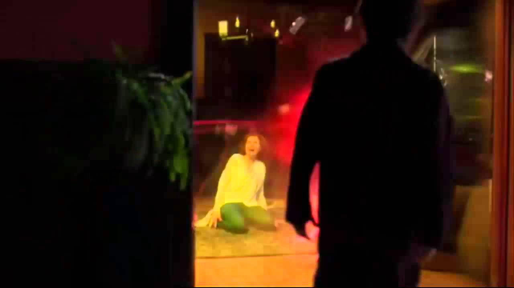
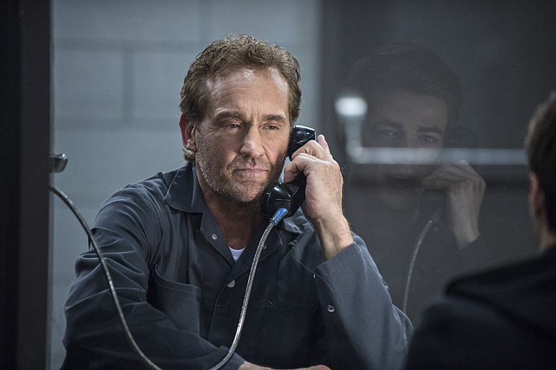
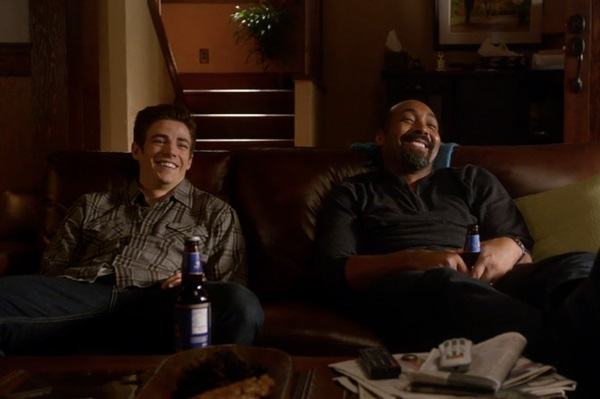
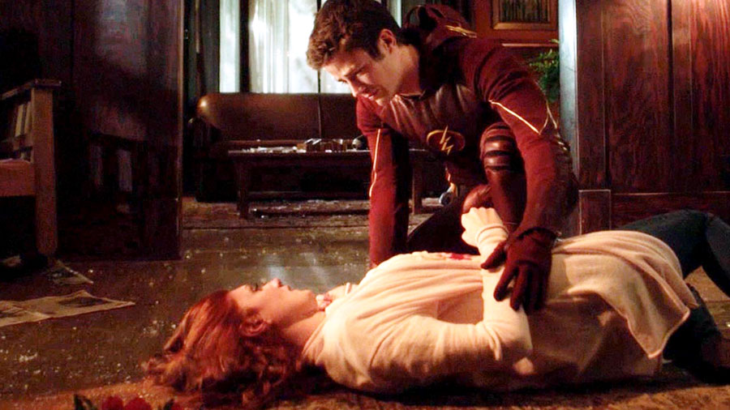
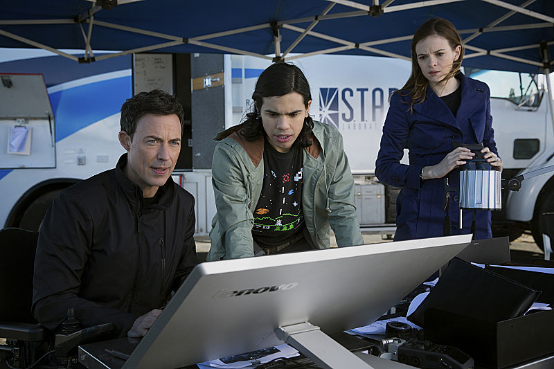

Something that's been zooming around my head these days is the current television series, *The Flash.* I read the comic as a kid and the new series fascinates me. The whole series is constructed around Barry's childhood trauma and is, therefore, ripe for symptomatic reading.

*"To understand what I'm about to tell you, you need to do something first. You need to believe in the impossible. Can you do that? Good."*

Right from the first voiceover, in his invoking narration at the beginning of the very first episode, he's openly asking us to believe in the impossible.

His powers are impossible. That's the irruption of the Real in the series. His powers signify nothing possible. They are the symptomatic, the return of the Real.

That Real is based in trauma, the traumatic murder of his mother.

Yes, Barry has serious mommy issues. His mother was murdered and his father is in prison for the crime. That's Barry's self-stated desire: finding who killed his mother, to clear his father's name and have him released from prison. The murder of his mother is a repetition of the original separation from his mother that occurred in the development of his subjectivity earlier in childhood. This is the original lack at his core, setting his desire in motion.

Barry also has daddy issues. His real dad is in prison, an absentee father but one with whom Barry still communicates. He was raised by Detective Joe West. Barry also works as a forensic scientist with Joe at the Central City Police Department. Joe was the physically-present father, but still doesn't believe Barry's memories of what happened the night of his mother's murder. Dr. Harrison Wells, too, serves as a father figure for Barry until he is revealed to be the Reverse Flash, Eobard Thawne, whose desire is to return to the future, at any cost.

The overdetermined father figures in his life can't make up for his lacking mother, however. His real desire is to become fast enough to race back in time and change the past; not to find his mother's killer, but to save his mother's life. In this way, he seeks to fill that original lack at his core, the desire to be the phallus for the mother, to be her object of desire.

Barry has further familial issues. He is in love with his foster-sister, Iris. His, at first unknown and then unrequited, desire for her is, again, symptomatic of the lack he feels at his core.

As Barry grows into his role of The Flash, he hears voices in his head. Through the audio transmitter in his mask, we typically hear the voice of Dr. Harrison Wells (Eobard Thawne), Cisco Ramon, or Dr. Caitlyn Snow instructing Barry on what to do or where to go. There are moments where Barry leaves behind the comm system or it goes out, but for the most part, he is guided not by his own conscious motivations, but by voices in his head.

The series is fruitful for a psychoanalytic reading.
