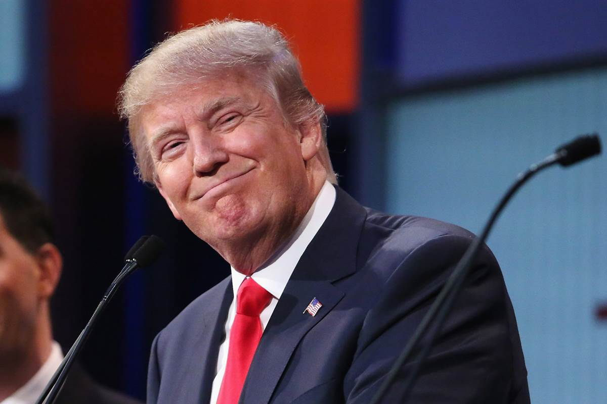

*Could the success of politicians like Donald Trump be the result of psychology?*

Donald Trump’s extraordinary success represents a political paradox to many opponents who reject what they perceive as his extremist xenophobic, simplistic politics. Critics continue to be perplexed as to why the richest man to run for President, attracts such passionate support from the poorest white constituency.

Or are politicians like Donald Trump simply more astute psychologists than their rivals?

Jay Frankel, from the Postdoctoral Program in Psychotherapy and Psychoanalysis, at New York University, and the Institute for Psychoanalytic Training and Research, has recently published a paper entitled 'The traumatic basis for the resurgence of right-wing politics among working Americans'....

[https://www.psychologytoday.com/blog/slightly-blighty/201601/the-psychoanalysis-politicians-donald-trump](https://www.psychologytoday.com/blog/slightly-blighty/201601/the-psychoanalysis-politicians-donald-trump)

Raj Persaud, M.D. and Peter Bruggen, M.D. - *Psychology Today*
