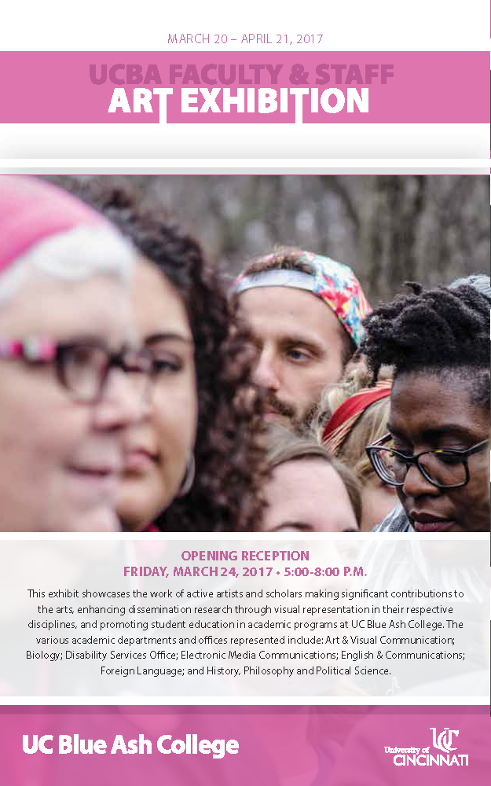

March 20 – April 21, 2017  
Opening Reception on Friday, March 24, 2017 from 5:00 - 8:00 p.m.

This exhibit showcases the work of active artists and scholars making significant contributions to the arts, enhancing dissemination research through visual representation in their respective disciplines, and promoting student education in academic programs at UC Blue Ash College. The various academic departments and offices represented include: Art & Visual Communication; Biology; Disability Services Office; Electronic Media Communications; English & Communications; Foreign Language; and History, Philosophy and Political Science.

