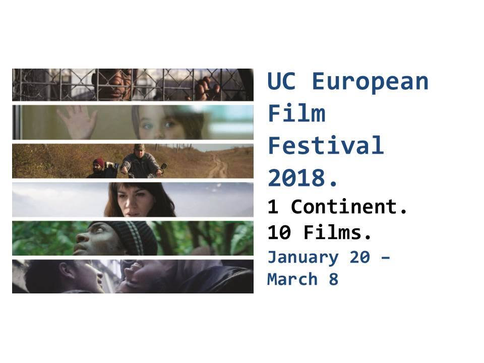

The UC European Film Festival begins January 20 at The Mini Microcinema. Our theme is the “Limits of European Cinema” and the selection will feature the latest contemporary films from European festivals and carefully selected classics. Come enjoy Westerns, “Easterns,” documentaries and mockumentaries from all corners of Europe. Screenings will be held at the Mini Microcinema, Esquire and the Cincinnati Art Museum (part of the "Moving Images Series").

For more information, visit the Facebook page for the Center for Film & Media Studies at the University of Cincinnati:

[https://www.facebook.com/pg/ucfilm/events/?ref=page\_internal](https://www.facebook.com/pg/ucfilm/events/?ref=page_internal)
