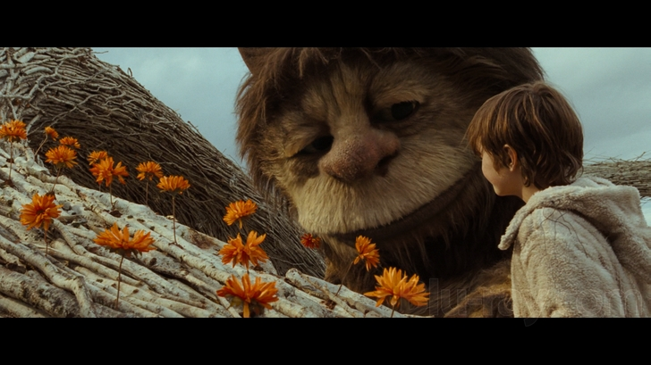

This Friday, June 24, the **Association for Psychoanalytic Thought** presents *Where the Wild Things Are*, directed by Spike Jonze based on Maurice Sendak's book. The screening will be followed by discussion about grief in a dramatic dreamscape by Rachel Zlatkin, Professor of English at NKU, and Alla Baskakova, psychiatrist at VA Medical Center.

Wine and cheese at 6:30. Program starts at 7pm.

Location: Cincinnati Psychoanalytic Institute, 3001 Highland Avenue, Cincinnati, OH 45219
